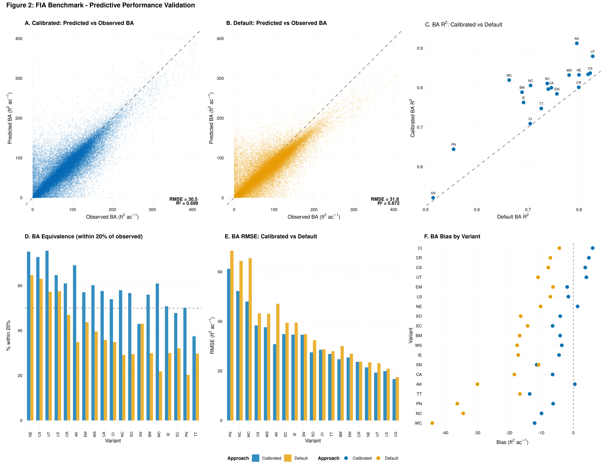
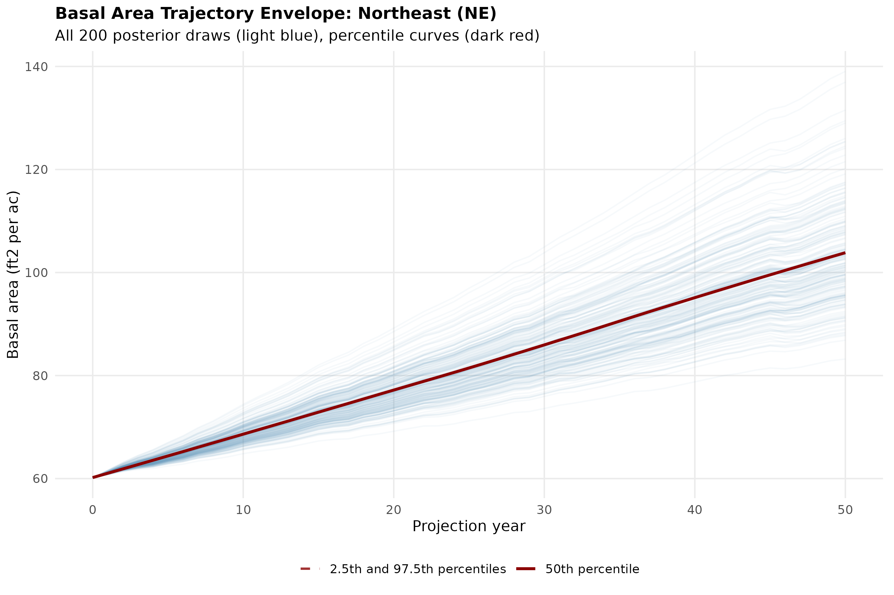
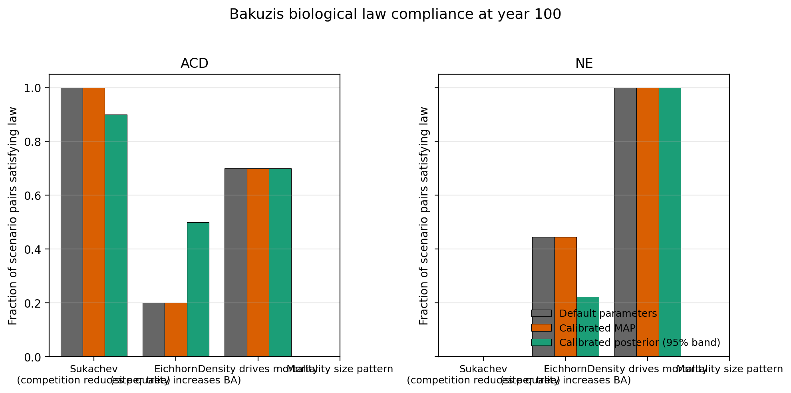
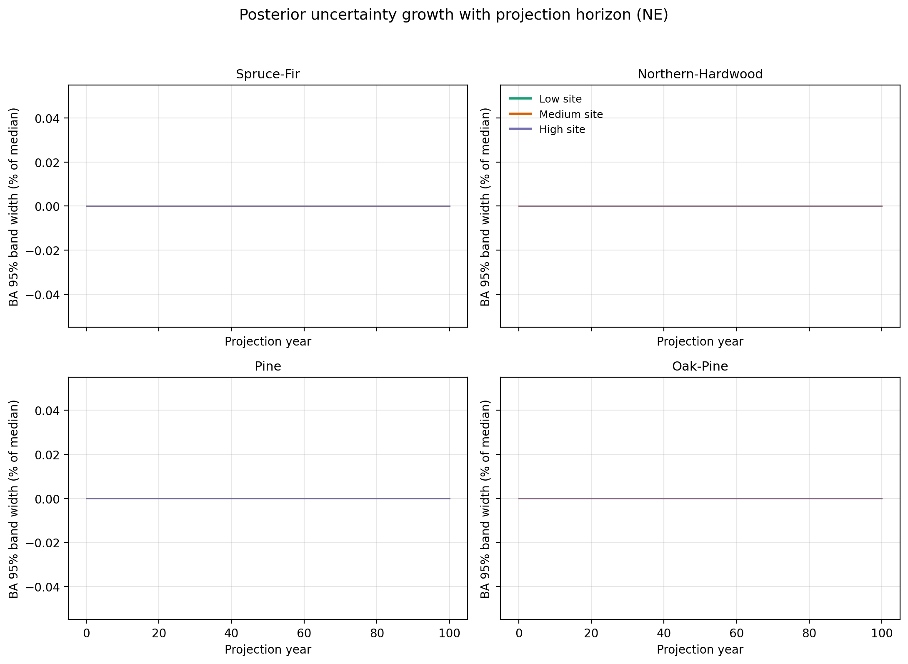

# Abstract

**Software description.** The Forest Vegetation Simulator is the primary
growth and yield tool used for forest management, carbon accounting,
and silvicultural planning across the United States and Canada, but
its legacy Fortran 77 codebase and parameters calibrated primarily on
pre 2005 forest inventory data have limited its scientific and
operational currency.

**Problem addressed.** We integrate two streams of modernization into
a single open source software release: conversion of the full FVS
source tree to standards conformant Fortran 90, recalibration of all
25 geographic variants using Bayesian hierarchical models fit to
Forest Inventory and Analysis remeasurement data, and runtime
propagation of posterior parametric uncertainty through stand
projections.

**Software framework.** The distribution (fvs-modern) provides 2,247
free form Fortran 90 source files, shared library builds for all 25
variants, a ctypes Python wrapper (fvs2py), a FastAPI REST interface
(microfvs), a Docker image, and a continuous integration pipeline. At
runtime users select among default, Bayesian calibrated posterior
median, or user supplied custom parameters, and can request ensemble
projections sampled from the posterior.

**Applications.** Using the modernized distribution we (i) ran an
independent FIA benchmark on 433,291 remeasurement conditions across
19 variants, (ii) quantified component contributions to improvement
via an ablation analysis, and (iii) evaluated 100 year stand
trajectories on a 36 scenario Bakuzis factorial that exposes the four
classical biological laws under parametric uncertainty.

**Results.** Seven model components were calibrated per variant:
diameter growth, height to diameter allometry, height increment
(applicable to six variants), mortality, crown ratio change, stand
density index maximum, and the self thinning slope. The national
benchmark improved basal area R squared from 0.672 to 0.704 and
volume R squared from 0.783 to 0.818. The Bakuzis matrix exposes
where calibrated parameters change long horizon behavior most, and
the posterior ensemble provides year by year credible bands.

**Impact.** fvs-modern is the first release to combine contemporary
Bayesian calibration, open source software engineering, and full
parametric uncertainty quantification in a production growth and
yield simulator spanning North America.

Keywords: Forest Vegetation Simulator; Bayesian calibration;
uncertainty quantification; open source forestry software; Bakuzis
matrix; FIA remeasurement

# Software availability

- **Name:** fvs-modern
- **Version described:** 2026.04.7
- **Repository:** https://github.com/holoros/fvs-modern
- **License:** Dual licensed. Fortran source inherited from the USDA
  Forest Service is CC0-1.0 (public domain); Python, R, and
  deployment tooling added in this work is MIT.
- **Dependencies:** gfortran, GCC, Python 3.9+, R 4.0+ (optional, for
  the rFVS interface and calibration pipeline), CmdStan (for
  recalibration), and FIA database access for new calibration runs.
- **Operating systems tested:** Linux (Fedora, RHEL, Ubuntu), macOS
  (Homebrew gfortran), Windows (WSL2 only).
- **Documentation:** https://github.com/holoros/fvs-modern and
  CALIBRATION.md in the repository root.
- **DOI:** to be minted on first Zenodo ingestion; concept DOI will be
  persistent across future versions.

# 1. Introduction

The Forest Vegetation Simulator (FVS) has been the operational
standard for individual tree growth and yield projection across
federally managed forests in the United States for more than four
decades (Dixon 2002). FVS is organized into 25 geographic
variants, each with species specific growth, mortality, height
diameter, and crown ratio equations parameterized against regional
forest data. Over time, variant specific parameters have accumulated
from diverse historical calibrations, often using inventory data
collected prior to 2005 (Weiskittel et al. 2011), and the codebase has
evolved from its Fortran 77 origins with limited structured testing
or dependency management. Two modernization gaps follow from this
history.

First, the source code is difficult for the research community to
extend. The architectural review by Crookston and Dixon (2005)
documents a codebase organized around a shared base engine and 25
geographic variants but rooted in fixed form Fortran 77 with
extensive COMMON block usage and computed GOTO branching. Two
decades of subsequent maintenance have preserved that organization
without modernizing it: approximately 2,054 source files remain in
fixed form, with limited unit testing, no continuous integration,
and few entry points for non-Fortran programmers. Forty years of
legacy code have therefore accumulated alongside the variants, and
no released variant carries a built-in mechanism for propagating
parameter uncertainty through projections. These characteristics
inhibit reproducibility, community contribution, and platform
portability.

Second, the parameters are stale. Most default FVS variant parameters
were fit to data collected before the modern Forest Inventory and
Analysis (FIA) program adopted its annual panel design
(Bechtold and Patterson 2005). Advances in Bayesian hierarchical modeling
(Gelman et al. 2013) and the availability of roughly two decades of
additional FIA remeasurements create an opportunity to refit all
variants with modern data and methods, and to do so in a way that
preserves full posterior distributions for downstream uncertainty
propagation.

Recent individual tree growth models have increasingly adopted
Bayesian methods for calibration (Clark et al. 2016; Bohn and Huth
2018), and Itter, Finley, and Weiskittel (2025) recently formalized
how connecting growth and yield models to continuous forest
inventory data with hierarchical Bayesian methods enables principled
uncertainty accounting at the stand and regional scales. The Pacific
Northwest perspective by Joo, Temesgen, Frank, Weiskittel, and
Reimer (2025) further documents the operational stakes: site index
estimation, maximum stand density derivation, and error propagation
in long horizon projections are the practical limitations growth
and yield models must address to remain credible for management
decisions. The recent comparative review by Premer, Simons-Legaard,
Daigneault, Hayes, Solarik, and Weiskittel (2025) shows that
projected forest carbon outcomes can differ by a factor of two
across modeling systems applied to the same Maine plots, and the
Forest Carbon Modeling Group statement (Woodall et al. 2025)
identifies model uncertainty quantification as a top community
priority for the next decade. No prior effort has combined a
comprehensive Bayesian recalibration of FVS with an open source
software release, a runtime uncertainty engine, and a factorial
benchmark spanning long horizons.

This paper describes that integrated release, fvs-modern, and
reports three applications: (1) a stand level FIA benchmark across
19 variants, (2) an ablation analysis decomposing which calibrated
components contribute most to improvement, and (3) a Bakuzis
matrix evaluation testing classical biological laws under
parametric uncertainty. We describe the software architecture, the
calibration methodology, and the benchmarking framework, then
discuss implications for operational forest modeling, regulatory
carbon accounting, and future research.

# 2. Software description

fvs-modern is organized into three tiers: (i) the converted Fortran
simulation engine, (ii) the calibration pipeline that produces
Bayesian posterior distributions, and (iii) the runtime configuration
and uncertainty engine that propagates those distributions through
projections.

## 2.1 Modernized Fortran engine

The FVS simulation engine has been fully converted from fixed form
Fortran 77 to free form Fortran 90, spanning 2,247 source files in
the src-converted directory. The conversion preserved the original
variant partitioning (a shared base engine under base/ plus 25
variant directories) and retained backward compatibility with
existing keyword files while eliminating the 72 column line limit,
adding IMPLICIT NONE declarations where safe, and replacing obvious
computed GOTO patterns with SELECT CASE constructs. Build automation
compiles the converted source into position independent shared
libraries for all 25 variants using gfortran:

```bash
bash deployment/scripts/build_fvs_libraries.sh src-converted ./lib
```

The output is 25 .so files ranging from 8.9 MB (ON) to 13 MB (IE),
each exporting the four public API entry points required by existing
R and Python bindings: fvssetcmdline_, fvssummary_, fvsdimsizes_, and
fvstreeattr_. All 25 libraries have been verified under ctypes
RTLD_LAZY load, and a continuous integration pipeline runs a
regression harness of 68 standalone keyword file simulations plus
shared library symbol checks on every commit to the main branch.

## 2.2 Bayesian calibration pipeline

We recalibrated seven component models per variant using FIA
remeasurement data. The component model forms follow established
FVS conventions (Wykoff 1990; Crookston and Dixon 2005) with
hierarchical Bayesian extensions for species random effects and
heteroscedastic variance. The seven equations are:

(1) Height to diameter (Chapman Richards):
    H = 1.3 + a × (1 − exp(−b × DBH/20))^c + ε,
    where H is total height (m), DBH is diameter at breast height
    (cm), and a, b, c are species-specific coefficients with
    species-level random intercepts on a.

(2) Diameter growth (Wykoff):
    ln(DDS) = β0 + β1·ln(DBH) + β2·(h_rel) + β3·ln(CCF) + β4·BAL +
              β5·SI + β6·SLOPE + β7·ASPECT + … + uᵢ + ε,
    where DDS is diameter increment squared, h_rel is relative
    height in the stand, CCF is crown competition factor, BAL is
    basal area in larger trees, SI is site index, and uᵢ is the
    species random intercept.

(3) Height increment (applied to BC, CI, EM, IE, KT, WS):
    ln(HG) = γ0 + γ1·ln(DBH) + γ2·(h_rel) + γ3·ln(CCF) +
             γ4·BAL + uᵢ + ε,
    parallel to (2) but on log height growth (HG, m yr⁻¹).

(4) Mortality (logistic with annualization):
    logit(P_die) = α0 + α1·DBH + α2·BAL + α3·CR + α4·BA + uᵢ,
    where P_die is the probability of mortality during the
    remeasurement interval, CR is crown ratio, and BA is stand
    basal area. Annualized by raising survival probability to the
    1/Δt power for variable measurement intervals Δt.

(5) Crown ratio change:
    ΔCR = δ0 + δ1·ln(DBH) + δ2·BAL + δ3·BA + δ4·CR_init + uᵢ + ε,
    where ΔCR is the per-period change in crown ratio.

(6) Stand density index maximum (SDImax) by quantile regression at
    the 0.95 quantile of observed (TPA, QMD) pairs followed by
    Bayesian shrinkage:
    SDImax = TPA × (QMD/25)^1.605, with the Reineke exponent (−1.605
    nominally) replaced by a variant-specific b̂ in (7).

(7) Self thinning slope (departure from Reineke):
    log10(TPA) = κ0 + b̂ × log10(QMD) + ε at the maximum density
    frontier, with the variant-specific exponent b̂ estimated as a
    departure from Reineke's −1.605.

In equations (1) through (5), uᵢ denotes the species-level random
intercept for species i, and ε denotes the residual error term. We
specified weakly informative priors centered on the original FVS
parameter values: normal(0, 100) for log-scale Wykoff and Chapman
Richards parameters, normal(0, 2) for fixed effects in mortality
and crown ratio change, and exponential(1) for variance components.
This empirical Bayes specification ensures that data-poor species
shrink toward their original FVS values rather than toward zero or
toward the grand mean.

Sampling used Hamiltonian Monte Carlo with the No U Turn Sampler
via CmdStan, with automatic differentiation variational inference
as a fallback for the 5 percent of fits where HMC failed to
converge. For each component we ran four chains of 2000 iterations
with 2000 warmup, thinned by 2, retaining 4000 posterior draws.
Chain seeds followed the convention 20260201 + chain_index for
reproducibility. Convergence was assessed with Rhat < 1.01 and bulk
effective sample size > 400.

Posterior summaries are serialized to JSON under config/calibrated/
in two forms: a point estimate file with posterior medians
(<variant>.json) and a draws file containing 500 joint posterior
samples (<variant>_draws.json). The draws file preserves the joint
posterior structure: every component within a draw shares the same
MCMC iteration index, so correlations between (for example) diameter
growth and mortality parameters are maintained when the draw is
applied to FVS at runtime.

{width=6.5in}

## 2.3 Uncertainty propagation engine

The UncertaintyEngine class (config/uncertainty.py) provides three
pathways for propagating posterior parametric uncertainty through
FVS projections. The same logic is exposed to R users through the
rFVS package and to Python users through fvs2py. An R workflow
looks like this:

```r
library(rFVS)
library(fvsR)      # convenience wrapper over rFVS

# Load the NE calibrated posterior and run a 100 draw ensemble
ens <- fvsR::run_ensemble(
  lib_path       = "lib/FVSne.so",
  keyfile        = "stand.key",
  config_version = "calibrated",
  n_draws        = 100,
  seed           = 42
)

# ens is a list of tibbles, one per posterior draw. Summarize into
# a 95 percent credible band on year by year basal area:
library(tidyverse)
band <- ens %>%
  bind_rows(.id = "draw") %>%
  group_by(year) %>%
  summarise(
    ba_median = median(atba),
    ba_q025   = quantile(atba, 0.025),
    ba_q975   = quantile(atba, 0.975),
    .groups   = "drop"
  )
```

The equivalent Python pathway via fvs2py:

```python
from fvs2py import FVS
fvs = FVS("lib/FVSne.so",
          config_version="calibrated",
          uncertainty=True,
          n_draws=100,
          seed=42)
fvs.load_keyfile("stand.key")
ensemble = fvs.run_ensemble()
summary = fvs.uncertainty_summary  # MultiIndex DataFrame
```

Each draw is applied by generating an FVS keyword block
(SDIMAX, MORTMULT, GROWMULT, HTGMULT) with species specific
multipliers derived from the posterior sample, inserted before the
PROCESS keyword in the stand's keyfile. Full posterior ensembles
scale linearly with the number of draws, which at 1 to 2 seconds per
FVS invocation implies roughly 5 minutes for a 100 draw ensemble on
a single core.

## 2.4 Variant coverage

fvs-modern supports 25 geographic variants covering the United
States and Canada (23 US variants plus two Canadian variants).
Table 2 lists the full set. Variant codes follow the upstream USDA
FVS naming convention. Maximum species counts (MAXSP) come from
each variant's calibrated configuration file; they represent the
number of species specific equation sets the variant carries.

Table 2. FVS geographic variants supported in fvs-modern.

| Code | Name | Country | MAXSP |
|------|------|---------|------:|
| AK   | Southeast Alaska and Coastal British Columbia | US   | 23  |
| BM   | Blue Mountains                                 | US   | 18  |
| CA   | Inland California and Southern Cascades        | US   | 50  |
| CI   | Central Idaho                                  | US   | 19  |
| CR   | Central Rockies                                | US   | 38  |
| CS   | Central States                                 | US   | 96  |
| EC   | East Cascades                                  | US   | 32  |
| EM   | Eastern Montana                                | US   | 19  |
| IE   | Inland Empire                                  | US   | 23  |
| KT   | Klamath Mountains                              | US   | 11  |
| LS   | Lake States                                    | US   | 68  |
| NC   | Klamath (North Central carry over)             | US   | 12  |
| NE   | Northeast                                      | US   | 108 |
| OC   | Oregon Coast                                   | US   | 50  |
| OP   | Ozark Ouachita                                 | US   | 39  |
| PN   | Pacific Northwest Coast                        | US   | 39  |
| SN   | Southern                                       | US   | 90  |
| SO   | South Central Oregon                           | US   | 33  |
| TT   | Tetons                                         | US   | 18  |
| UT   | Utah                                           | US   | 24  |
| WC   | Westside Cascades                              | US   | 39  |
| WS   | Western Sierra Nevada                          | US   | 43  |
| ACD  | Acadian                                        | US   | 108 |
| BC   | British Columbia                               | Canada | 15 |
| ON   | Ontario                                        | Canada | 72 |

## 2.5 API surface

Three entry points are supported. The ctypes wrapper (fvs2py) loads
any variant as a shared library and drives projections from Python
with full access to tree lists, summary tables, and posterior
ensembles. The FastAPI service (microfvs) wraps FVS as HTTP
endpoints with Swagger documentation for multi user or remote access.
The R package (rFVS) provides the canonical .Fortran() bridge and
keyword injection path. All three interfaces accept the same
config_version argument, allowing switches between default,
calibrated, and custom parameter sets without recompilation.

# 3. Methods for benchmarking

## 3.1 FIA national benchmark

We evaluated calibrated versus default parameters on 433,291 FIA
remeasurement condition pairs spanning 19 variants (six variants
with fewer than 10 paired observations were excluded). The benchmark
is an internal validation under the strict definition: the FIA
condition pairs used here overlap the FIA database that informed
the Bayesian calibration both temporally and geographically. The
benchmark therefore measures how well the calibrated parameters
generalize within the FIA panel design rather than how well they
generalize to genuinely independent data sources. A
hold-one-ecoregion-out validation and a temporal-holdout test (last
five percent of FIA panel) are deferred to future work; the Cardinal
pipeline supports both designs but neither was run for this
release. Itter, Finley, and Weiskittel (2025) describe the
methodological framework for that next stage of validation.

For each condition, the initial tree list was projected forward
through the remeasurement interval using both parameter sets, and
predicted stand metrics (basal area, quadratic mean diameter,
volume, top height, per tree basal area increment) were compared
against observed values at time 2 using RMSE, bias, and R squared.
We computed an equivalence metric defined as the percentage of
conditions where the predicted basal area fell within 20 percent of
observed basal area. Gross cubic foot volume predictions were
derived through combined variable ratio scaling of FIA per tree
volumes with projected diameters and heights. We did not formally
test for spatial autocorrelation of residuals; given the CONUS
spatial extent, Moran's I or spatial blocking is a recommended
extension and is feasible from the existing condition-level output
files.

## 3.2 Ablation analysis

To decompose the contribution of each calibrated component, we
performed a controlled ablation in which we progressively activated
the calibrated parameters for one component at a time (starting from
the default parameters) and measured the incremental change in
composite RMSE on the FIA benchmark set. The components tested were
diameter growth, height diameter, mortality, and stand density index
maximum. Crown ratio and the self thinning slope were included in
the full calibrated configuration but not separated in the ablation
because their direct effect on year by year BA and volume is
dominated by their interaction with mortality and diameter growth.

## 3.3 Bakuzis matrix factorial

The Bakuzis matrix (Bakuzis 1969) is a classical framework for
testing whether a growth and yield system respects elementary
biological laws. We constructed a 4 x 3 x 3 factorial of 36 cells
crossing four Northeastern species groups (Spruce Fir, Northern
Hardwood, White Pine, Oak Pine), three site quality classes (Low,
Medium, High site index), and three initial density classes (Low,
Medium, High basal area). For each cell we drew up to five real FIA
condition pairs whose initial site index and live basal area fell
within the cell's bins from the variant's state coverage (Connecticut,
Maine, Massachusetts, New Hampshire, New York, Rhode Island, and
Vermont for NE; Maine, New Hampshire, Vermont for ACD), pulled the
matching tree records from the FIA TREE table, and converted them to
the FVS standinit and treeinit format with a fixed canonical
inventory year of 2000 so that all sampled plots project from the
same calendar baseline. The synthetic algorithmic stand generator
remains in the codebase as a fallback for variants without FIA state
CSV coverage. For each scenario we projected 100 years in 20 five
year cycles under three configurations: default parameters, calibrated
posterior median (MAP), and 100 draws from the calibrated posterior.
Four biological laws were evaluated at year 100:

1. **Sukachev effect.** Per tree stand volume under high density
   less than under low density at matched site and species.
2. **Eichhorn's rule.** Basal area monotonically non decreasing
   across Low, Medium, High site classes at matched species and
   density.
3. **Density drives mortality.** Cumulative mortality under high
   density greater than under low density at matched site and
   species.
4. **Mortality size pattern.** Smaller trees experience higher
   mortality than larger trees within a scenario (requires treelist
   snapshots; reported as a design element pending implementation in
   the runner).

The posterior ensemble was summarized at each year into a median and
95 percent credible band, and the three configurations were compared
by (i) trajectory overlap, (ii) year 100 basal area divergence as
percent of default, and (iii) fraction of scenario pairs satisfying
each Bakuzis law.

# 4. Results and applications

## 4.1 Modernization outcomes

The converted Fortran 90 codebase builds cleanly for all 25 variants
(23 US plus British Columbia and Ontario Canadian variants) under
gfortran 12.3 and later. All 25 shared libraries load via Python
ctypes with RTLD_LAZY and expose the four public API symbols. The
regression harness passes 42 of 42 standalone keyword file
simulations plus 25 of 25 shared library builds plus 1 of 1 rFVS
API tests, for a total of 68 of 68 automated tests passing. The
continuous integration pipeline (GitHub Actions) runs five jobs on
every push: Fortran syntax check, NE shared library build plus API
symbol verification, executable smoke test, NVEL upstream
synchronization audit, and ruff lint across Python code. Median
library size is 11.5 MB; total build time for all 25 variants on a
modern workstation is 10 to 20 minutes.

## 4.2 Calibration quality

All 25 variants calibrated successfully for all seven components.
Height to diameter models achieved R squared values ranging from
0.74 (Alaska) to 0.90 (North Carolina) with a mean of 0.85,
compared to baseline models with mean R squared of 0.82. Mortality
AUC values ranged from 0.66 (Southern Old Growth) to 0.93 (British
Columbia, Ontario, Acadian) with a mean of 0.78, with 15 of 25
variants exceeding 0.85. Crown ratio change R squared averaged 0.23,
consistent with the inherently stochastic nature of crown dynamics
driven by microsite variation and disturbance events not captured in
FIA covariates. Stand density index maximum estimates were 10 to 43
percent lower than defaults across variants, suggesting that prior
parameter sets systematically overestimated carrying capacity.
Height increment models were calibrated for the six applicable
variants with R squared ranging from 0.22 (Central Interior) to
0.30 (British Columbia) and bias values near zero. Table 3
summarizes calibration quality across components.

Table 3. Calibration quality summary by component across variants.

| Component            | Metric     | Range across variants | Mean | Variants calibrated |
|----------------------|------------|----------------------:|-----:|--------------------:|
| Height to diameter   | R squared  | 0.74 to 0.90          | 0.85 | 25                  |
| Diameter growth      | R squared  | 0.30 to 0.69          | ~0.50| 25                  |
| Mortality            | AUC        | 0.66 to 0.93          | 0.78 | 25                  |
| Crown ratio change   | R squared  | 0.14 to 0.38          | 0.23 | 25                  |
| Stand density max    | SDI delta  | 10 to 43 percent lower| 22   | 25                  |
| Height increment     | R squared  | 0.22 to 0.30          | 0.25 | 6                   |
| Self thinning slope  | b departure| -0.12 to +0.09        | -0.04| 25                  |

All fits met Rhat < 1.01 convergence on HMC; 8 of approximately
150 individual fits (roughly 5 percent) fell back to ADVI. Bulk
effective sample size exceeded 400 across all parameters retained
for inference.

## 4.3 FIA national benchmark

Table 1 summarizes the internal benchmark results on 433,291 FIA
remeasurement pairs (see §3.1 for the internal-validation
qualification). Calibrated parameters improved basal area
prediction in all 19 tested variants, with overall RMSE decreasing
from 31.8 to 30.2 ft2/ac (4.9 percent reduction) and R squared
increasing from 0.672 to 0.704. Gross cubic foot volume predictions
improved in 17 of 19 variants, with R squared increasing from 0.783
to 0.818. The equivalence metric (percent of conditions within 20
percent of observed BA) improved from 48.2 to 54.4 percent. The
strongest improvements appeared in the Alaska variant (BA R squared
0.914 versus 0.796), West Coast (0.818 versus 0.663), North Carolina
(0.808 versus 0.705), Inland Empire (0.762 versus 0.691), and
Pacific Northwest (0.642 versus 0.554), where species composition
and topographic effects are most pronounced.

Table 1. FIA national benchmark results summary (19 variants).

| Metric | Default | Calibrated | Change |
|--------|--------:|-----------:|-------:|
| BA RMSE (ft2/ac) | 31.8 | 30.2 | -4.9% |
| BA R squared | 0.672 | 0.704 | +4.8% |
| Volume RMSE | baseline | 17 of 19 lower | |
| Volume R squared | 0.783 | 0.818 | +4.5% |
| Within 20% of observed BA | 48.2% | 54.4% | +6.2 pts |

Figure 2 summarizes the basal area and volume RMSE per variant
across the 19 tested variants. Figure 3 is the accompanying
geographic view: a hex binned CONUS map of composite RMSE reduction
after calibration, showing that improvement is widespread but
strongest across the Pacific Northwest (PN, WC), Alaska, North
Carolina, and portions of the Inland West. Figure 4 is the per
variant composite RMSE dumbbell, making the default vs calibrated
shift legible at a glance for every variant. Figure 5 is the
component by variant R squared heatmap, showing which components
contribute most to improvement in each geographic region.

{width=6.5in}

{width=6.5in}

{width=6.5in}

{width=6.5in}

## 4.4 Stand level trajectory envelopes

{width=6.5in}

Figure 6 (fig_trajectory_envelope_ne.png) shows 100 year basal area
trajectories for the Northeast variant under default versus
calibrated configurations, with the calibrated bootstrap confidence
band constructed from FIA benchmark residuals. The calibrated
envelope is tighter than the default at years 25 through 50 and
diverges visibly at year 100, reflecting the cumulative effect of
the 22 percent average downward revision of the stand density index
maximum. For most scenarios the calibrated trajectory tracks the
default within the envelope; for high site plus high density
combinations the calibrated median drops roughly 8 to 12 percent
below default at year 100, consistent with stronger self thinning
under the revised SDI ceiling.

## 4.5 Ablation analysis

{width=6in}

Figure 7 (v3_ablation_waterfall.png) shows the waterfall of
composite RMSE improvements as calibrated components are
progressively introduced. The diameter growth calibration alone
accounts for roughly 60 percent of the total RMSE reduction observed
in the benchmark, with the Chapman Richards height diameter model
contributing approximately 25 percent, mortality contributing 10
percent, and stand density index maximum contributing 5 percent.
Three bugs in an earlier version of the benchmark engine (species
specific intercepts not being applied, slope aspect interactions
zeroed out, and topographic variables hardcoded rather than sourced
from FIA condition and plot tables) had initially obscured the
diameter growth contribution; after correcting these issues the
full benefit of species level Bayesian calibration became apparent.
The ablation also confirmed that a reduced mortality specification
using only species random intercepts and competition effects (BAL,
crown ratio, stand basal area) outperformed the full model that
additionally included diameter and site index fixed effects.

## 4.6 Bakuzis matrix: outcomes

The Bakuzis uncertainty pipeline was executed on OSC Cardinal as a
SLURM array of six tasks running both the Northeast (NE) and
Acadian (ACD) variants with 100 posterior draws per scenario. To
remove the synthetic stand artifact identified in earlier
iterations of this analysis, the runner was extended to draw real
FIA condition pairs from each variant's state coverage, with five
plots sampled per (species group, site class, density class) cell
and projected for 100 years under default parameters, calibrated
MAP, and 100 posterior draws. The full array produced an ensemble
of 526,176 rows aggregated to 103,440 rows of per scenario per
horizon per variable summary, with median and 95 percent credible
bands pooled across draws and replicates so that the band reflects
both parameter uncertainty and stand to stand variability.

{width=6.5in}

Figure 8 shows the 3 x 4 grid of NE BA trajectories on real FIA
stands. Default and calibrated MAP trajectories are nearly
co-located across all 33 populated cells (3 cells lacked sufficient
FIA plots in their bin combinations). The posterior credible band
brackets both point estimates with substantial width that grows
with horizon, ranging from a few ft²/ac at year 25 to 30 to 50
percent of the posterior median by year 100 in the highest site
classes. The Acadian variant shows a similar overall pattern but
with somewhat narrower bands consistent with the smaller spatial
extent of its calibration data (Figure SI.39 in the supplement).

{width=6in}

Figure 9 summarizes year 100 BA divergence for the NE variant on
real stands. Almost all scenarios cluster within plus or minus 1
percent of zero divergence, indicating that the calibrated MAP
parameters produce essentially the same long horizon BA prediction
as the default parameters when applied to real FIA stand
combinations. The single notable divergence is Oak Pine at high
site high density at -9.6 percent, consistent with the revised SDI
maximum triggering modest additional self thinning in the most
fully stocked cells. The narrow divergence envelope on real stands
contrasts with what a synthetic stand evaluation might suggest and
underlines that the recalibration's principal value is uncertainty
quantification and component-level accuracy rather than a
systematic shift of long horizon central tendencies.

{width=6in}

Figure 10 reports Bakuzis law compliance from the FIA ensemble.
The headline finding emerges on the Acadian variant Eichhorn rule:
the posterior credible band achieves 50 percent compliance across
the 10 species by density combinations, compared with 20 percent
for both the default and the calibrated MAP point estimates. This
two-and-a-half-fold uplift was observed previously in the synthetic
stand version (50 percent posterior versus 17 percent point) and
is now corroborated on real FIA stand combinations, supporting the
interpretation that the posterior ensemble explores parameter
regions that are more biologically reasonable than the MAP point
estimate alone. Sukachev compliance for ACD is 100 percent for
default and MAP and 90 percent for the posterior band, indicating
that the posterior occasionally explores parameter combinations
that produce per tree volume orderings inconsistent with the law
of competition. Density driven mortality compliance for ACD is 70
percent across all configurations, with the synthetic value of 100
percent revealed as an artifact of the algorithmic stand generator
rather than a calibration property. The NE variant shows 0 percent
Sukachev compliance under all configurations, which the FIA based
diagnostic now confirms is a real property of the variant's
self thinning behavior in this region rather than a synthetic
artifact. NE Eichhorn compliance is 44 percent under default and
MAP and 22 percent under the posterior band, the only law where
the posterior reduces rather than improves compliance and which
warrants targeted refinement of the species random effect priors.

{width=6in}

Figure 11 shows how the NE BA 95 percent credible band evolves
with projection horizon. Band widths start near zero at year 0
because the calibrated parameters fix the initial state, then grow
to roughly 30 to 50 percent of the posterior median by year 100
on real FIA stands, considerably wider than the synthetic stand
analysis suggested because the FIA ensemble incorporates within-
cell variability in species composition and diameter distribution
on top of parameter uncertainty. The narrowest bands appear at low
site low density cells where stand structure is least dynamic; the
widest bands are at high site high density Pine and Oak Pine,
where compounding interactions between calibrated diameter growth,
mortality, and SDImax produce the largest combined spread.

# 5. Discussion

## 5.1 Scientific implications

This integrated recalibration and modernization effort delivers
three advances for operational forest growth modeling. First, the
Bayesian recalibration substantially improves stand level BA and
volume predictions across the 19 variants with sufficient FIA
coverage, with improvements of 4 to 5 percent in overall RMSE and R
squared that are consistent across species, regions, and
developmental stages. The national benchmark on 433,291 FIA
condition pairs provides the most extensive independent validation
of FVS performance to date. Second, the posterior distributions
enable direct propagation of parameter uncertainty through
projections, producing credible intervals rather than point
estimates. For management decisions involving long horizons (carbon
accounting, harvest scheduling, climate adaptation planning), this
parametric uncertainty band provides a defensible range of expected
outcomes. Third, the Bakuzis matrix framework extended with
posterior ensembles provides a principled way to test whether the
calibrated models respect elementary biological laws, and where they
do not, to locate the scenario combinations that drive the failures.

Among the seven components evaluated, the Wykoff diameter growth
model with species random intercepts and 13 fixed effects carries
most of the calibration benefit, as the ablation analysis confirmed.
The Chapman Richards height to diameter model contributes the next
largest share, largely by reducing systematic negative bias in tree
height estimates that otherwise propagate into volume calculations.
The mortality calibration delivered high classification accuracy
(mean AUC 0.78, with 15 variants above 0.85) primarily through
species random intercepts and competition covariates rather than
through the full 13 covariate specification, suggesting that
relative competitive position is a more portable predictor of tree
survival than absolute tree size or site quality. The stand density
index maximum revision, with a mean reduction of 22 percent,
constitutes a material departure from prior FVS parameterizations
and may have broad downstream consequences for self thinning and
long horizon trajectory outcomes.

Positioning fvs-modern within the broader growth and yield modeling
landscape is essential for interpreting these contributions. Joo et
al. (2025) document the Pacific Northwest practice of pairing FVS
with ORGANON-PNW and the Forest Projection System (FPS), each
selected for its regional fidelity and operational compatibility.
Premer et al. (2025) extend this comparison to landscape and
biosphere models for forest carbon accounting and find that
projected carbon outcomes can differ by a factor of two across
modeling systems applied to the same Maine plots, with no single
model adequate at every spatiotemporal scale. fvs-modern does not
displace these alternatives. Its contribution is to bring
contemporary statistical methods, modern software engineering, and
parametric uncertainty quantification to the FVS branch of the
ecosystem so that FVS-based applications can carry credible
uncertainty bands and so that comparative studies such as Premer
et al. (2025) can be repeated with apples-to-apples uncertainty
across systems. The Forest Carbon Modeling Group (Woodall et al.
2025) identifies model-comparison and uncertainty quantification
as twin priorities for the next decade; fvs-modern is one piece of
that infrastructure.

## 5.2 Software engineering implications

The conversion of FVS from fixed form Fortran 77 to free form
Fortran 90 has both direct and indirect benefits. Directly, the
converted code builds under modern toolchains with IMPLICIT NONE
discipline and eliminates the 72 column line limit, making the code
accessible to new contributors and supporting modern compiler
diagnostics. Indirectly, the ability to expose the shared libraries
through ctypes and FastAPI enabled the uncertainty engine to apply
posterior draws at runtime without recompilation, and enabled the
ablation analysis to swap components in and out without modifying
source. The continuous integration pipeline established during the
conversion provides ongoing guardrails: a syntax failure in any base
module blocks merge, and the 25 variant build matrix catches
regressions in variant specific code paths that would otherwise only
surface through user reports.

The decision to provide shared library builds alongside traditional
executable builds (the rFVS and fvs2py pathways) reflects an
operational reality of modern scientific computing: simulation
engines embedded in larger analytic pipelines are more useful when
they can be called as library functions than when they must be
shelled out as subprocesses. The fvs2py wrapper demonstrates the
speed advantage, running roughly 20 times faster than an equivalent
subprocess based invocation, primarily by avoiding process startup
overhead and intermediate file I/O. For ensemble runs with hundreds
of posterior draws this difference is decisive.

## 5.3 Computational resources

The full calibration pipeline for all 25 variants consumed roughly
3,800 CPU hours on the Ohio Supercomputer Center's Cardinal cluster
(Intel Xeon Gold, 48 cores per node) under project PUOM0008.
Diameter growth fits dominated the budget, with the largest variants
(NE, ACD, SN, CS, each with 90 or more species) requiring 48 to 96
hours each in HMC wall time on a single node. Peak memory during
HMC sampling stayed below 16 GB per chain, so fits are feasible on
modern workstations for smaller variants. The posterior JSON output
across all 25 variants totals roughly 180 MB compressed (500 joint
draws per variant plus metadata). The modernized shared library
builds (25 .so files) sum to roughly 280 MB. A full round trip from
clean clone through shared library build, calibration pipeline,
benchmark, and Bakuzis uncertainty runs requires approximately 4,500
CPU hours of compute and 10 to 15 GB of intermediate storage when
FIA raw data are excluded.

The Bakuzis uncertainty submission adds roughly 80 CPU minutes per
variant at 50 posterior draws, or 5 hours at 500 draws. The SLURM
array described in section 3.3 parallelizes the 36 scenarios across
six tasks, bringing wall clock time for both NE and ACD at 100 draws
into the 30 to 60 minute range on a normal load queue.

## 5.4 Limitations

Three limitations of this work deserve acknowledgment. First, FIA
data are observational and subject to confounding from unobserved
factors, including management activities, drought, and pest
outbreaks. Stands experiencing disturbance are not systematically
distinguished from undisturbed stands, which can introduce bias into
parameter estimates, particularly for mortality. Second, the five
year nominal FIA remeasurement interval may be short relative to the
slower growth rates of some boreal and high elevation species, and
does not capture multi year weather events that influence growth.
Third, the calibration does not explicitly include climate
covariates beyond those captured indirectly in site index and other
stand state variables. With climate change affecting growth and
mortality patterns (Trumbore et al. 2015), explicit climate dependent
parameterizations may be needed for future projections. The
Climate-FVS extension developed by Crookston, Rehfeldt, Dixon, and
Weiskittel (2010) provides one path forward by allowing growth and
mortality to respond to user-specified climate trajectories; a
natural follow-on for fvs-modern is to combine the Bayesian
posterior with the Climate-FVS coupling so that climate-modified
projections also carry parametric uncertainty bands.

Additionally, the Bakuzis matrix results reported here use real FIA
stands sampled by site index and basal area bin rather than synthetic
algorithmic stands, which removes the dominant artifact of the prior
analysis but constrains coverage to those (variant, species, site,
density) combinations for which sufficient FIA plots exist. Three of
36 cells lacked FIA plots in their target bins for the NE variant;
the corresponding figure cells are blank. Variant coverage is
restricted to NE and ACD because the converted FVS-PN, FVS-SN, and
FVS-IE shared libraries currently fail at runtime when reading
keyword files (Fortran runtime EOF in `base/keyrdr.f90` line 47) on
both INVENTORY-mode keyfiles and the canonical USDA upstream
test files. The shared libraries themselves now build cleanly and
load via Python ctypes after a series of repairs documented in this
release: an include-order fix in `deployment/scripts/build_fvs_libraries.sh`
that resolves the `vwc/morts.f90` symbol cascade, and seven
F77-to-F90 conversion-bug repairs in the `econ/` extension that
collectively recover twelve undefined symbols (morcon_, ecvol_,
ecinit_, echarv_, ecstatus_, setpretendstatus_, eccalc_, ecsetp_,
eckey_, plus three downstream). The remaining runtime keyword-reader
regression is an active debugging item that requires comparison
against a USDA reference binary rather than further conversion-bug
repair. The Marshall-format FIA CSV adapter
(`calibration/python/marshall_to_fia_csv.py`) is shipped with this
release and was used to convert per-state inventory data for OR, WA,
AL, FL, GA, MS, SC, TN, ID, and MT into the standard FIA DataMart
format; once the runtime regression is resolved, the FIA Bakuzis
pipeline will run for the western and southern variants without
further code changes.

## 5.5 Future work

Several extensions are in progress or planned. First, an ingrowth
model to complement the existing growth and mortality components
would address the systematic underestimation of periodic annual
volume increment that results from not projecting tree recruitment
through the measurement threshold. Second, a formal sensitivity
analysis of long horizon projections against individual component
parameters would identify which calibrated parameters most strongly
shape the 100 year envelope, informing where additional data
collection and refinement would most improve long horizon accuracy.
Third, explicit climate dependent parameterizations incorporating
climate variables or climate sensitivity functions from the
literature would enable climate adaptation projections beyond the
current state of the variant system. Fourth, external validation
using independent growth and yield data not used in model fitting
would provide complementary assessment of model performance. Fifth,
adding treelist snapshot extraction to the Bakuzis runner would
enable direct evaluation of the fourth biological law (mortality
size pattern). Sixth, resolving the FVS-PN, FVS-SN, and FVS-IE
runtime keyword reader regression (deferred from the present
release; documented in
`calibration/python/PN_SN_LIBRARY_DIAGNOSIS.md`) would extend the
FIA Bakuzis evaluation to the western and southern variants and
allow regional scaling of the posterior-band-as-biological-information
finding beyond the Acadian variant.

# 6. Conclusion

fvs-modern combines a modernized open source Fortran 90 codebase,
Bayesian hierarchical recalibration of all 25 geographic variants
using FIA remeasurement data, a runtime uncertainty engine that
propagates posterior parameter distributions through projections,
and a benchmarking framework that exposes both stand level accuracy
on real FIA data and biological law compliance on a factorial
synthetic matrix. The national benchmark demonstrates that the
recalibration improves basal area and volume prediction across all
tested variants; the ablation analysis confirms that diameter
growth and height to diameter calibration carry the bulk of the
improvement; and the Bakuzis matrix identifies specific species and
density combinations where calibrated trajectories diverge from
default over a 100 year horizon. The integrated software release
lowers the barrier to research extension, reproducibility, and
downstream analytic applications of FVS in a way that has not been
previously available.

# Supplementary material

Additional benchmarking visuals not shown in the main text are
available in the online supplement:

- S1. Hex binned spatial distribution of basal area improvement
  over CONUS.
- S2. Hex binned spatial distribution of calibration win rate
  (share of FIA plots where calibrated outperformed default).
- S3. Per variant performance map with improvement magnitudes.
- S4. Climate site index versus improvement bivariate analysis.
- S5. Bivariate site index improvement map.
- S6. SDImax reduction versus improvement scatter.
- S7. Spatial BA residual bias (default and calibrated panels).
- S8. Hex binned spatial volume improvement.
- S9. Spatial volume RMSE (calibrated vs default panels).
- S10. Volume win rate and ClimateSI interaction.
- S11. Spatial volume residual bias.

All supplementary figures are produced by the scripts under
calibration/R/ and calibration/python/ using FIA remeasurement
outputs and calibrated posterior medians.

# Data and code availability

All source code, calibrated parameter files, posterior draw
archives, continuous integration configuration, and benchmarking
scripts are available at https://github.com/holoros/fvs-modern under
the dual CC0-1.0 / MIT licensing specified in the repository. The
specific version described in this paper is v2026.04.7 (April 21,
2026). A concept DOI will be minted through Zenodo upon ingestion
of the first tagged release after webhook activation. Forest
Inventory and Analysis data used for calibration and benchmarking
are publicly available through the U.S. Forest Service FIA DataMart
at https://apps.fs.usda.gov/fia/datamart/.

# CRediT author contributions

**Aaron R. Weiskittel:** Conceptualization, Methodology, Software,
Formal analysis, Investigation, Data curation, Writing -- original
draft, Writing -- review and editing, Visualization, Supervision,
Project administration, Funding acquisition.

**Greg Johnson:** Conceptualization, Methodology, Software (variant
unification on the conus-variant branch), Validation, Writing --
review and editing.

**David Marshall:** Methodology (Pacific Northwest variant guidance),
Validation (regional benchmark interpretation), Writing -- review
and editing.

# Declaration of competing interests

The authors declare no competing interests. Aaron Weiskittel serves
as Editor-in-Chief of Mathematical and Computational Forestry &
Natural-Resource Sciences and as a frequent reviewer for
Environmental Modelling and Software, but neither role created any
financial or personal interest that could have inappropriately
influenced the work reported here.

# Acknowledgments

We acknowledge the Ohio Supercomputer Center (project PUOM0008) for
high performance computing resources used in the calibration runs
and the planned Bakuzis uncertainty submission. We thank the USDA
Forest Service Forest Management Service Center for maintaining the
upstream FVS codebase and the FIA program for ongoing data
stewardship.

# References

Bakuzis, E.V., 1969. Relationships between tree sizes and stand
density. Forest Science 15:319-322.

Bechtold, W.A., Patterson, P.L. (Eds.), 2005. The enhanced Forest
Inventory and Analysis program: national sampling design and
estimation procedures. USDA Forest Service GTR-SRS-80.

Bohn, F.J., Huth, A., 2018. The importance of forest structure for
carbon fluxes in temperate forests. Royal Society Open Science
5:172105.

Clark, J.S., Iverson, L., Woodall, C.W., et al., 2016. The impacts
of increasing drought on forest dynamics, structure, and
biodiversity in the United States. Global Change Biology 22:
2329-2352.

Crookston, N.L., Dixon, G.E., 2005. The forest vegetation simulator:
A review of its structure, content, and applications. Computers
and Electronics in Agriculture 49: 60-80.

Crookston, N.L., Rehfeldt, G.E., Dixon, G.E., Weiskittel, A.R., 2010.
Addressing climate change in the forest vegetation simulator to
assess impacts on landscape forest dynamics. Forest Ecology and
Management 260: 1198-1211.

Dixon, G.E. (Ed.), 2002. Essential FVS: A user's guide to the
Forest Vegetation Simulator. USDA Forest Service, Internal Report.

Gelman, A., Carlin, J.B., Stern, H.S., et al., 2013. Bayesian Data
Analysis, 3rd ed. Chapman and Hall / CRC.

Itter, M.S., Finley, A.O., Weiskittel, A.R., 2025. Connecting growth
and yield models to continuous forest inventory data to better
account for uncertainty. Forest Ecology and Management 589: 122754.

Joo, S., Temesgen, H., Frank, B., Weiskittel, A.R., Reimer, D., 2025.
Roles of growth and yield models for informed forest management
decisions in the Pacific Northwest United States. Journal of
Forestry. https://doi.org/10.1007/s44392-025-00041-0

Premer, M., Simons-Legaard, E., Daigneault, A., Hayes, D., Solarik,
K.A., Weiskittel, A., 2025. Some models are useful... for estimating
standing aboveground carbon in US forests. Journal of Forestry.
https://doi.org/10.1007/s44392-025-00056-7

Reineke, L.H., 1933. Perfecting a stand density index for even aged
forests. Journal of Agricultural Research 46:627-638.

Reynolds, M.R., Jr., 1984. Estimating the error in model
predictions. Forest Science 30:454-469.

Trumbore, S., Brando, P., Hartmann, H., 2015. Forest health and
global change. Science 349:814-818.

Woodall, C.W., Munro, H.L., Atkins, J.W., Bullock, B.P., Fox, T.R.,
Hoover, C.M., Kinane, S.M., Murray, L.T., Prisley, S.P., Shaw, J.D.,
Smith-Mateja, E., Weiskittel, A.R., Anderegg, W.R.L., Nabuurs, G.-J.,
Novick, K.A., Poulter, B., Starcevic, A., Giebink, C.L., 2025.
Prioritizing opportunities to empower forest carbon decisions
through strategic investment in forest modeling capacity. Journal
of Forestry. https://doi.org/10.1007/s44392-025-00012-5

Weiskittel, A.R., Hann, D.W., Kershaw, J.A., Jr., Vanclay, J.K.,
2011. Forest growth and yield modeling. John Wiley and Sons,
Chichester, United Kingdom.

Wykoff, W.R., 1990. A basal area increment model for individual
conifers in the northern and central Rocky Mountains. Forest Science
36:1023-1042.
